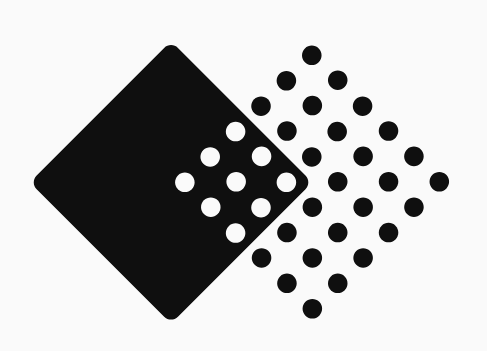

<p align="center">
  
</p>

<h1 align="center">RevengeBench</h1>

<h3 align="center">Reverse Engineering Code-Space Policies from Behavioral Experiments</h3>

<p align="center">
  <strong>Babak Rahmani*</strong> &nbsp;&middot;&nbsp;
  <strong>Sebastian Dziadzio*</strong> &nbsp;&middot;&nbsp;
  <strong>Joschka Strüber*</strong> &nbsp;&middot;&nbsp;
  <strong>Sergio Hernández-Gutiérrez</strong> &nbsp;&middot;&nbsp;
  <strong>Matthias Bethge</strong>
</p>

<p align="center">
  Tübingen AI Center
</p>

<p align="center">
  (*) Equal contribution.
</p>

<p align="center">
  <a href="https://arxiv.org/abs/XXXX.XXXXX"></a>
  <a href="https://huggingface.co/datasets/bethgelab/revengebench"></a>
  <a href="https://revengebench.com/#leaderboard"></a>
</p>

---

RevengeBench poses an inverse problem in code-space: given only behavioral
traces of an opaque target agent acting in a programming-game arena, can a
learner reconstruct a runnable program that reproduces the target's behavior?
The benchmark is built on **75 LLM-generated, Elo-calibrated target policies**
across five arenas: BattleSnake, Halite, HuskyBench, RoboCode, and RobotRumble.

The protocol pairs **passive observation with constrained active intervention**.
The learner watches the hidden target play sampled opponents and may author
*probe opponents*: runnable policies whose interaction with the target induces
new trajectories. A probe acts only through the normal gameplay channel and has
no privileged access to target source or internal state. The learner submits one
executable hypothesis, which is scored by action-distance on held-out target
states and by downstream player-versus-player tournaments.

This public release keeps upstream CodeClash as a git submodule and places the
RevengeBench-specific package in `src/revenge_bench`.

## Layout

```text
revenge-bench/
├── vendor/codeclash/          # Upstream CodeClash submodule
├── src/revenge_bench/         # RevengeBench package
│   ├── arenas/                # Release arena wrappers/extensions
│   ├── tournaments/           # Inverse-strategy, Forward-PvP, and BPI tournaments
│   ├── agents/                # LLM agent wrappers
│   ├── traces/                # Per-arena trace parsers
│   └── scripts/               # Importable pipeline utilities
├── configs/
│   ├── benchmark/             # Main model x arena configs
│   ├── conditions/            # Public optional conditions: no-probe, NL observation
│   ├── baselines/             # Public baselines, including BPI
│   ├── prompts/               # Runtime prompt templates
│   └── forward_pvp/           # Forward-PvP configs
├── data/targets/              # Target policy pools
├── scripts/                   # Runtime and evaluation entry points
│   └── codeclash_strategies/  # Optional target-pool generation tooling
├── tests/
└── main.py                    # Compatibility entry point
```

## Installation

```bash
git clone --recurse-submodules <repo-url> revenge-bench
cd revenge-bench
uv venv .venv --python 3.11
source .venv/bin/activate
uv pip install -e .
```

If you cloned without submodules:

```bash
git submodule update --init --recursive
```

You also need Docker, or Singularity/Apptainer with `CODECLASH_RUNTIME` set.
Copy `.env.example` to `.env` and fill in the API keys for the LLM providers
you plan to use.

## Running The Benchmark

Main pool run:

```bash
bash scripts/run_pool.sh --seeds "42"
```

This iterates over `configs/benchmark/<model>/<model>_<game>.yaml`.
Useful runner flags include `--dry-run`, `--resume`, `--parallel N`,
`--configs "name_a name_b"`, and `--config-dir <dir>`.

Public optional conditions and baselines use the same runner:

```bash
bash scripts/run_no_probe.sh --seeds "42"
bash scripts/run_nl_observation.sh --seeds "42"
bash scripts/run_bpi.sh --seeds "42"
```

Forward-PvP runs use the curated configs under `configs/forward_pvp/`:

```bash
bash scripts/run_forward_pvp.sh \
    --challengers "gpt5 gpt5-mini gpt-oss-120b grok-4.1-fast kimi-k2.6 deepseek-v3.2"
```

## Optional Tracks

The main benchmark condition is active inverse-strategy recovery with probes.
The public release also includes:

- `configs/conditions/no_probe/`: trace-only recovery with active probes disabled.
- `configs/conditions/nl_observation/`: recovery from LLM-generated natural-language summaries of traces.
- `configs/baselines/bpi/`: Bayesian Program Inference baseline configs.
- `configs/forward_pvp/`: downstream PvP configs comparing blind, recovered, and oracle opponent intelligence.

Paper-only plotting, history-compaction sweeps, reset-memory sweeps, and probe
prompt ablation suites are intentionally not part of this release package.

## Adding Target Policies

Create a directory under `data/targets/<arena>/<policy_name>/` with a
`main.py` implementing the arena's player API. See the existing target pools
for examples.

Optional CodeClash target-pool generation helpers live under
`scripts/codeclash_strategies/`. They can download CodeClash viewer artifacts,
extract runnable strategies, validate them, and run Elo selection:

```bash
bash scripts/codeclash_strategies/build_pool.sh --game BattleSnake --count 40
```

## Relationship To CodeClash

RevengeBench started from CodeClash and still relies on CodeClash's arena and
execution abstractions. The upstream CodeClash source is preserved as a
submodule in `vendor/codeclash`; RevengeBench-specific code lives in
`src/revenge_bench` so the benchmark can evolve without modifying the vendored
upstream tree.

## Citation

```bibtex
@article{rahmani2026revengebench,
  title={RevengeBench: Reverse Engineering Code-Space Policies from Behavioral Experiments},
  author={Rahmani, Babak and Dziadzio, Sebastian and Str{\"u}ber, Joschka and Hern{\'a}ndez-Guti{\'e}rrez, Sergio and Bethge, Matthias},
  journal={arXiv preprint arXiv:XXXX.XXXXX},
  year={2026}
}
```

## License

This repository is released under the MIT License. See `LICENSE` for details.
